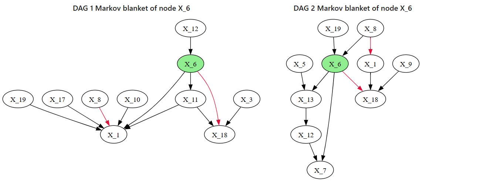
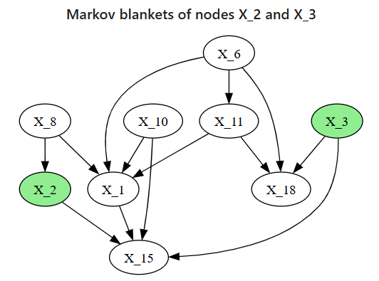

# 🚀 Getting Started with BNM

BNM (**Bayesian Network Metrics**) is a Python package for evaluating and visualizing Bayesian Networks and Directed Acyclic Graphs (DAGs), originally developed for microbial network comparisons, but applicable to any causal graph analysis.

---

## 🔧 Installation

You can install BNM directly from GitHub:

```bash
pip install git+https://github.com/averinpa/bnm.git
```
# 📦 Requirements for BNM

BNM relies on the following Python packages:

| Package     | Version       | Description                                              |
|-------------|---------------|----------------------------------------------------------|
| `networkx`  | >=2.8         | For working with graph structures                        |
| `graphviz`  | >=0.20        | For visualizing DAGs               |
| `pandas`    | >=1.3         | For constructing and manipulating metrics tables         |
| `numpy`     | >=1.21        | For numerical operations and array processing            |

---

## ✅ Basic Usage

### 1. **Import the package**

```python
from bnm import BNMetrics, generate_random_dag
```
### 2. **Create or load graphs**  
#### You can generate random DAGs using the built-in utility:

```python
G1 = generate_random_dag(n_nodes=20, edge_prob=0.08, seed=42)
G2 = generate_random_dag(n_nodes=20, edge_prob=0.10, seed=99)
```
### 3. **Initialize the `BNMetrics` object**
```python
bnm = BNMetrics(G1, G2)
```
#### You can also use just one graph:
```python
bnm_single = BNMetrics(G1)
```
### 4. **Compare graph structures**
#### Generate metrics:
```python
df = bnm.compare_df(
    descriptive_metrics=["n_edges"],
    comparison_metrics=["shd", "precision", "recall"]
)
print(df.head())
```
| node_name | n_edges_base | n_edges | shd | precision | recall   |
|-----------|--------------|---------|-----|-----------|----------|
| All       | 15.0         | 19.0    | 30  | 0.105263  | 0.133333 |
| X_8       | 3.0          | 0.0     | 3   | 0.0       | 0.0      |
| X_15      | 1.0          | 3.0     | 4   | 0.0       | 0.0      |
| X_1       | 5.0          | 6.0     | 11  | 0.0       | 0.0      |
| X_6       | 2.0          | 2.0     | 4   | 0.0       | 0.0      |

### 5. **Visualize the DAGs**
#### Compare two graphs side by side:
```python
bnm.compare_two_bn(nodes=["X_5", "X_18"], option=1)
```

#### Plot a single DAG:
```python
bnm.plot_bn(nodes=["X_1", "X_5"], layer="d2")
```

## 📚 More

- [API Reference](https://github.com/averinpa/bnm/blob/main/docs/api_reference.md)
- [Paper (Averin et al., 2025)](https://doi.org/10.20944/preprints202503.0943.v1)
- [R Version of DAGMetrics](https://github.com/averinpa/DAGMetrics)